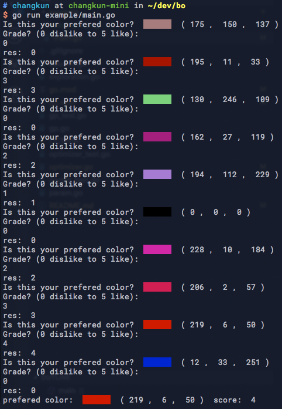

# bo

Bayesian Optimization in Go

## Example: Learning human preference

Task: Pick a color and keep the color stable in your mind. 
Bayesian optimization is able to learn your preference interactively.

```go
go run example/main.go
```

The following result assumes a picked color is (255, 0, 0)



## License

MIT
